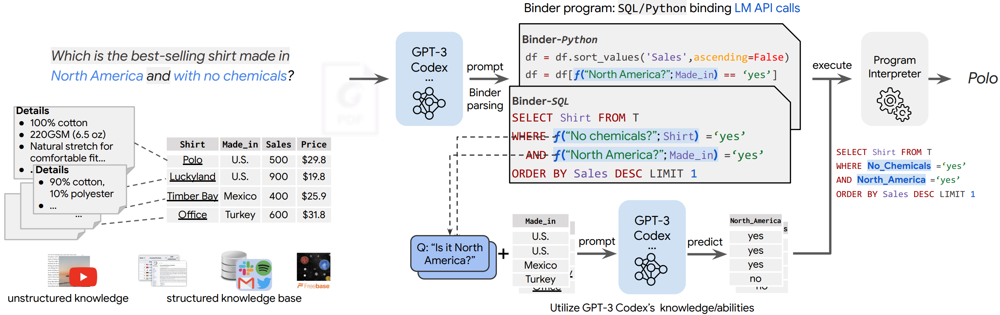

# Binder
<p align="left">
    <a href="https://img.shields.io/badge/PRs-Welcome-red">
        
    </a>
    <a href="https://img.shields.io/github/last-commit/HKUNLP/Binder?color=green">
        
    </a>
    <br/>
</p>

Code for paper [Binding Language Models in Symbolic Languages](). Please refer to our [demo page]() to have an instant experience of Binder.




## Updates

## Dependencies
To establish the environment run this code in the shell:
```bash
conda env create -f py3.7binder.yaml
pip install records==0.5.3
```
That will create the environment `binder` we used.


## Usage

### Environment setup
Activate the environment by running
``````shell
conda activate binder
``````

### Environment Variable Set Up
It's better to set environment variable to `TOKENIZERS_PARALLELISM` to `false`, if you use our multiprocess script to run code.

### Add key
Get `private key`(sk-xxxx like) from OpenAI, and save the key in `key.txt` file, make sure you have the rights to access the model you need.

### Run
Take running WikiTableQuestion as an example, first cd into its directory `scripts`. (For TabFact and MultiModalQA, they are `scripts_tab_fact` and `scripts_mmqa` respectively.)

Then run the script of each setting for End2end QA, SQL and NSQL(SQL Binder). 
```bash
python multiprocess_annotate_fixprompt_NSQL.py
```

After the annotation generation, feed the file name of the generated file into the execution script to perform execution on it.
```bash
python multiprocess_execute_NSQL.py
```

Worth noticing that, due to the speed limitation from OpenAI, if the program get stuck at request, please adjust hyper-parameter `num_parallel_prompts`(which control the number of examples to be packed into a request) to shorten the tokens per request.